## 轴板与轴板的连接顺序
从视频中截图：
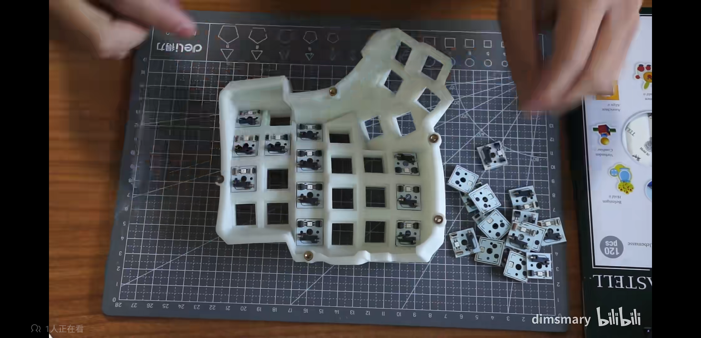

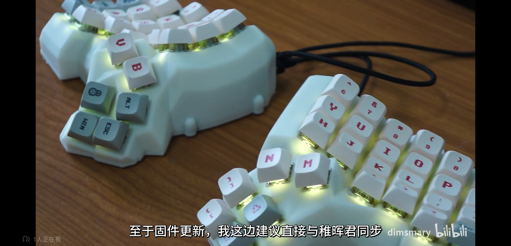

通过FPC的颜色进行区分轴板，不难看出其部分的连接顺序（箭头起始为U3，箭头为U1）：
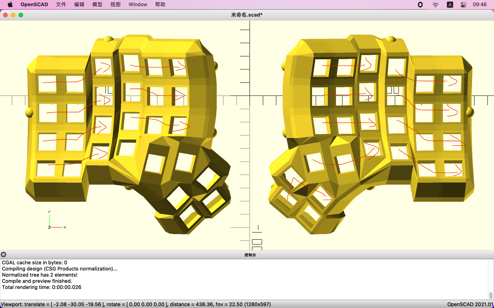

又有U3、U2、U1的轴板一定是要向右才能依次连接的，不难推测，其连接顺序为以下两种之一（其实怎么连都可以的，不用完全照搬Dimsmary，只要在固件中做对应修改即可）：
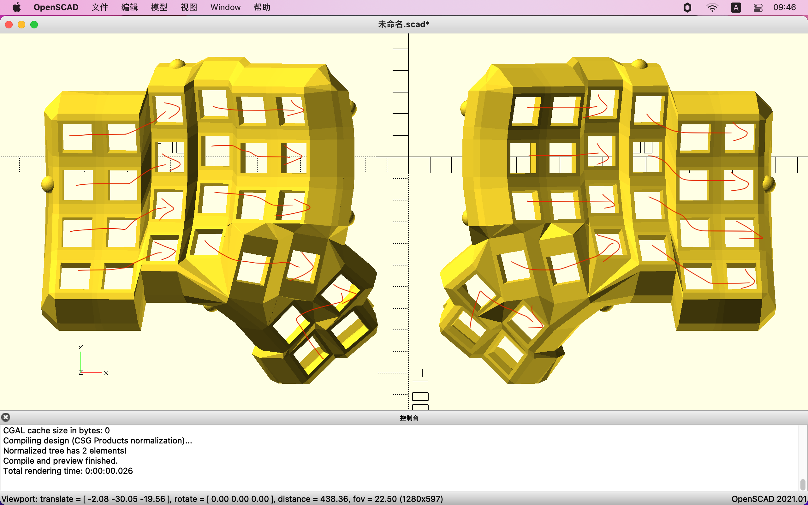

## 移位寄存器的扫描顺序
通过阅读[稚辉君对HelloWord固件的说明](https://oshwhub.com/pengzhihui/b11afae464c54a3e8d0f77e1f92dc7b7)后：
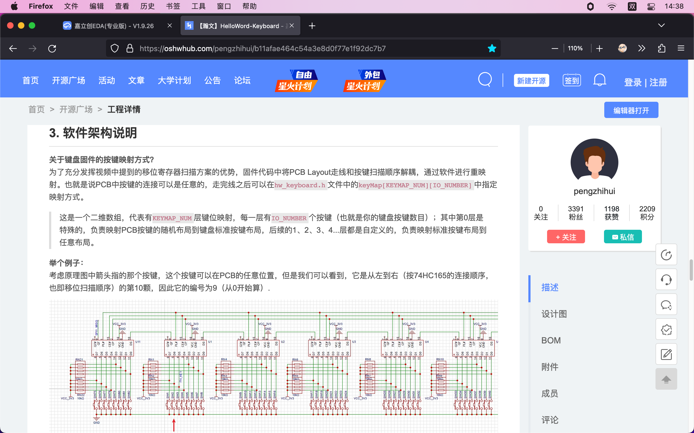

根据以下已知条件对Dactyl-HelloWord的固件代码中的列表元素进行区分（其实你读懂了说明就不需要下面的步骤，直接自己连接、改代码即可）：

1. 以Dimsmary的键盘（截图3.png）和轴板连线图(肯定1.png)为参考，将按键列表中由左往右连续一致的3个元素为一个分组
2. 由轴板的连线图中可知（肯定1.png），左右各有一个单个轴板串联的按键
3. 由于左板和右板的移位寄存器的个数一致，可将列表中的元素按 IO数/2 区分对应左板、右板的按键元素（下图中已提前标注）
4. 由原理图可知，左板、右板的移位寄存器前个4个io没有连接按键，故其对应的键位不具有参考价值。且左右板没有连接按键的io都是最左边的四个，故列表中0～3和32～35元素不具有参考价值

通过观察按键分布，不难看出，前32位的元素都分布在Dimsmary的左键盘，后32位的元素都分布在Dimsmary的右键盘。

故移位寄存器的扫描顺序是由右扩展板往左主控板。

通过对比固件代码和Dimsmary的键盘按键分布图，易得Dimsmary的轴板连接顺序是第二种。

## IO列表对应的FPC座
通过对比移位寄存器所连接的按键，和FPC座所连接的按键：
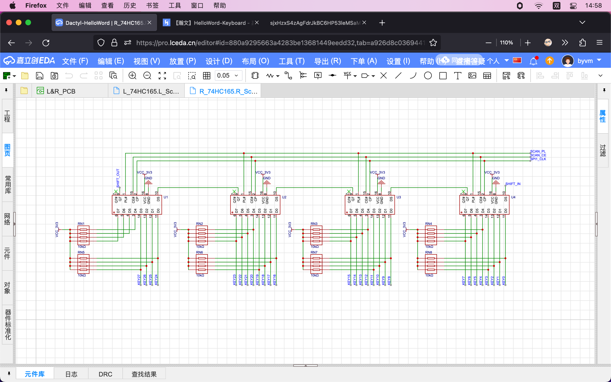

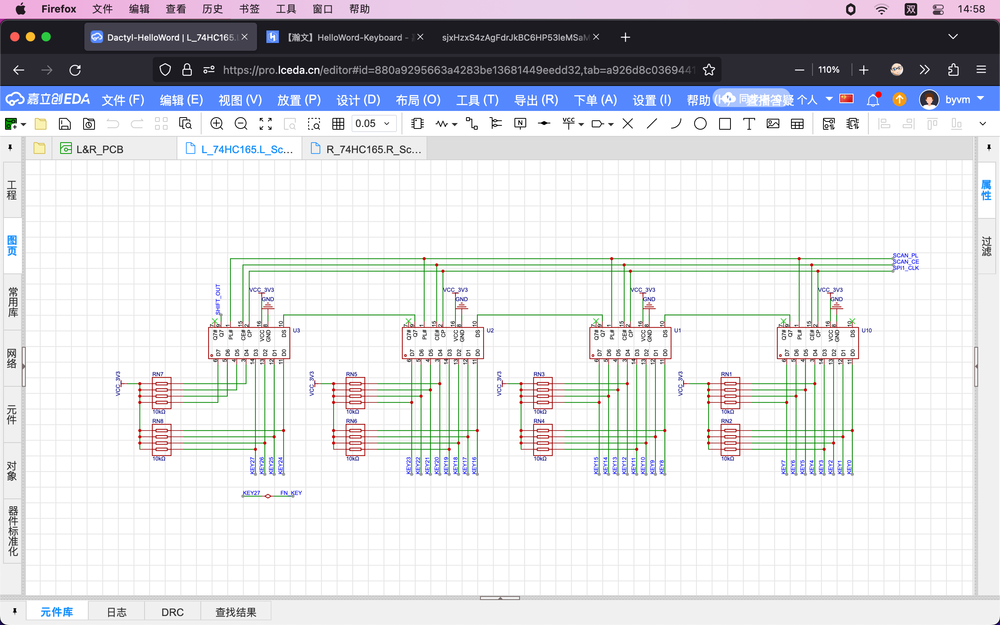
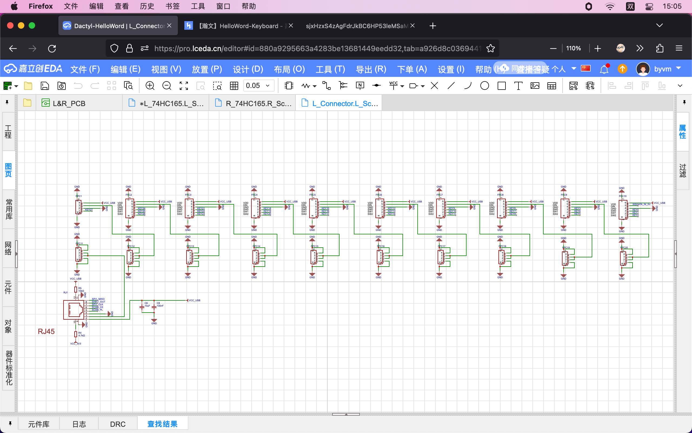

不难看出各个IO列表中的元素所对应的FPC座（不懂就看稚辉君的固件说明）：
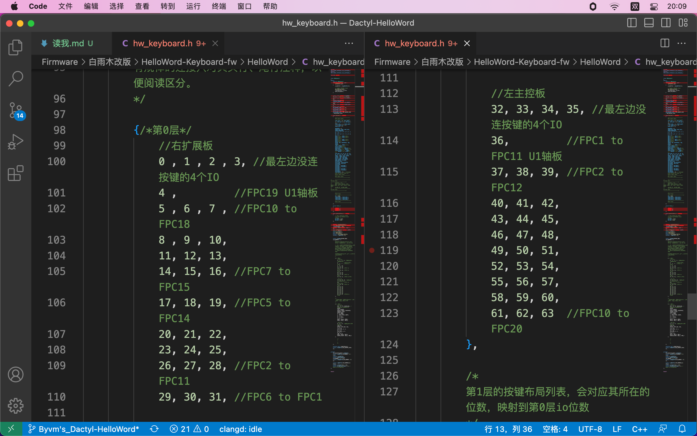

## 轴板和左右板的连接
通过综合对比以下已知信息：

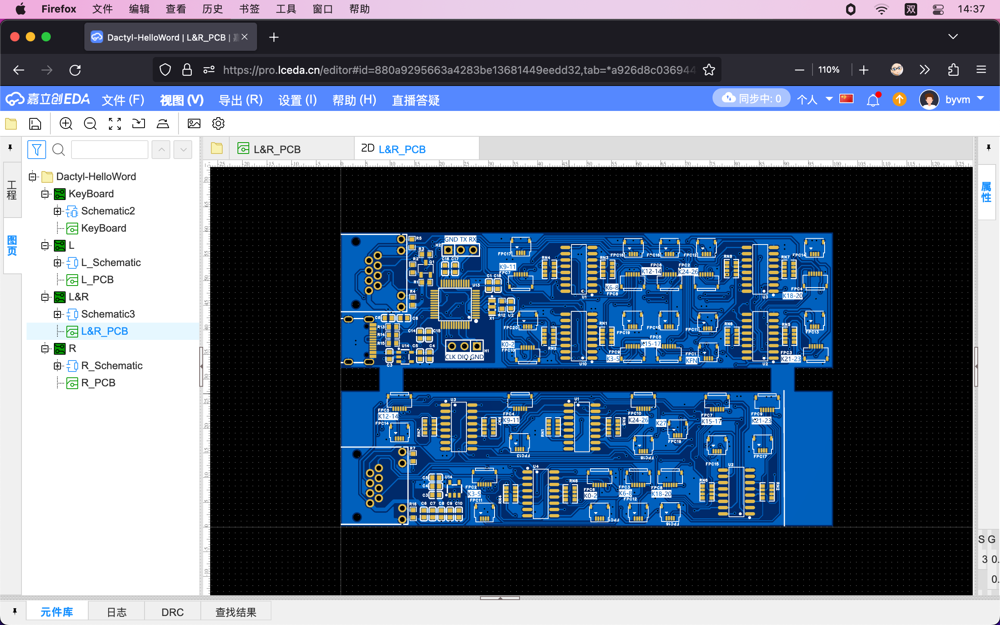

映射、连线求解，得：
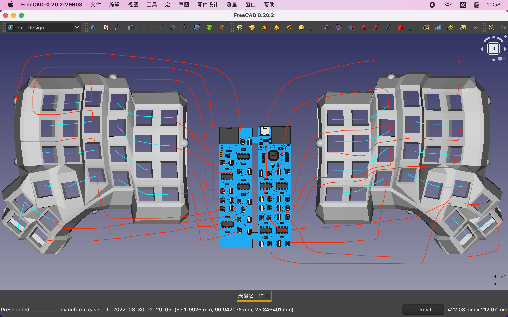